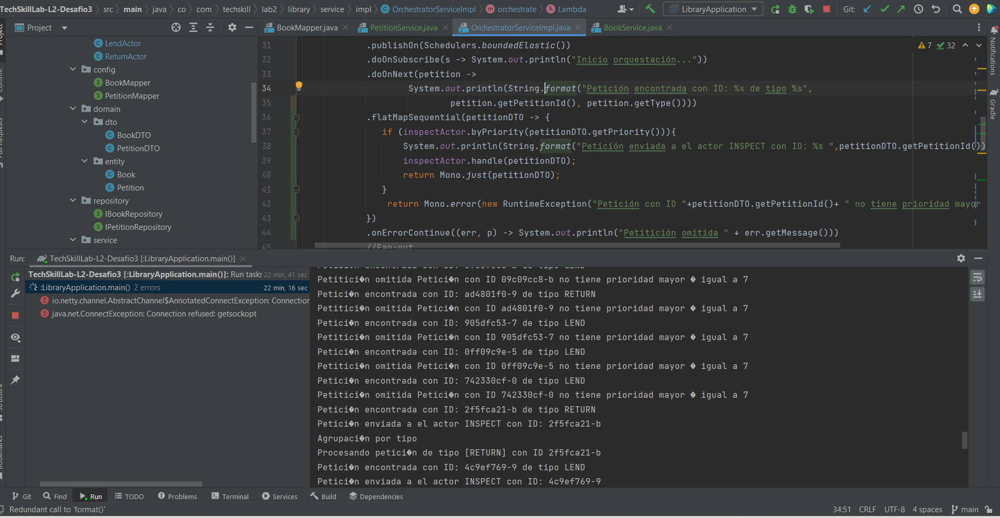

# TechSkillLab-L2-Desafio3
Código base para el desarrollo práctico de la clase #3 y su correspondiente desafío.

### Desafio 3

Se agrega un tercer actor que inspeciona aquellas peticiones con prioridad mayor o igual a 7

